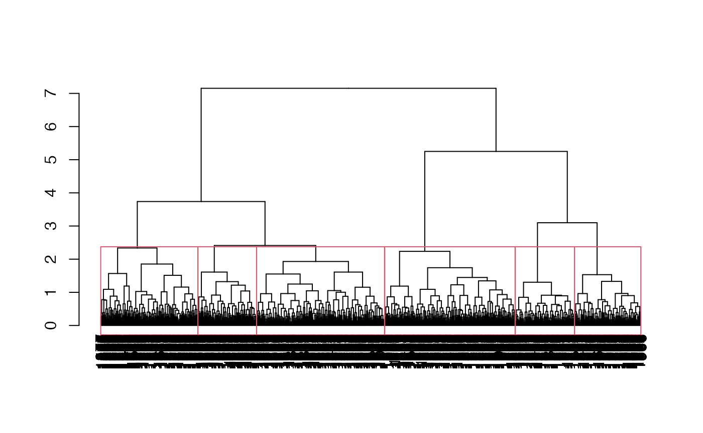

# Example Dataset in \`SampleCore\`

ICAR-National Bureau of Plant Genetic Resources, New Delhi.

## Introduction

The example datasets `cassava_EC` and `cassava_CC` in `EvaluateCore` for
demonstrating various functions were generated using the following steps
from the source data
([**international_institute_of_tropical_agriculture_cassava_2019?**](#ref-international_institute_of_tropical_agriculture_cassava_2019)).

## Setup the environment

``` r
# Load required packages
library(EvaluateCore)
```

    ## 
    ## --------------------------------------------------------------------------------
    ## Welcome to EvaluateCore version 0.1.3.9000
    ## 
    ## 
    ## # To know whats new in this version type:
    ##   news(package='EvaluateCore')
    ##   for the NEWS file.
    ## 
    ## # To cite the methods in the package type:
    ##   citation(package='EvaluateCore')
    ## 
    ## # To suppress this message use:
    ##   suppressPackageStartupMessages(library(EvaluateCore))
    ## --------------------------------------------------------------------------------

``` r
library(cluster)
library(NbClust)
```

## Load and prepare data

``` r
# Get data from EvaluateCore

data("cassava_EC", package = "EvaluateCore")
data = cbind(Genotypes = rownames(cassava_EC), cassava_EC)
quant <- c("NMSR", "TTRN", "TFWSR", "TTRW", "TFWSS", "TTSW", "TTPW", "AVPW",
           "ARSR", "SRDM")
qual <- c("CUAL", "LNGS", "PTLC", "DSTA", "LFRT", "LBTEF", "CBTR", "NMLB",
          "ANGB", "CUAL9M", "LVC9M", "TNPR9M", "PL9M", "STRP", "STRC",
          "PSTR")
rownames(data) <- NULL

# Convert qualitative data columns to factor
data[, qual] <- lapply(data[, qual], as.factor)

# Standardise quantitative data column
data[, quant] <- lapply(data[, quant], function(x) {
  scale(x)[, 1]
})
```

## Perform the clustering

``` r
# Set the seed
set.seed(123)

# Get the Gower's distance matrix
data_dist <- daisy(x = data[, c(qual, quant)], metric = "gower")

# Perform Ward's minimum variance clustering
data_clust <- hclust(d = data_dist, method = "ward.D2")

# Identify optimum number of cluster
nc_result <- NbClust(diss = data_dist, distance = NULL, 
                     min.nc = 2, max.nc = 6,
                     method = "ward.D2",
                     index = "cindex")
```

    ## 
    ##  Only frey, mcclain, cindex, sihouette and dunn can be computed. To compute the other indices, data matrix is needed

``` r
nc <- nc_result$Best.nc["Number_clusters"]

# Plot dendrogram with nc = 6 clusters
plot(as.dendrogram(data_clust))
rect.hclust(data_clust, k = nc)
```



``` r
# Add the group to the original data
cassava_EC_gp <- cassava_EC
cassava_EC_gp$Cluster <- as.roman(nc_result$Best.partition)
cassava_EC_gp$Cluster <- as.factor(as.character(cassava_EC_gp$Cluster))

# View the final data
str(cassava_EC_gp)
```

    ## 'data.frame':    1684 obs. of  27 variables:
    ##  $ CUAL   : chr  "Dark green" "Light green" "Dark green" "Dark green" ...
    ##  $ LNGS   : chr  "Medium" "Long" "Long" "Medium" ...
    ##  $ PTLC   : chr  "Green purple" "Green purple" "Purple" "Purple" ...
    ##  $ DSTA   : chr  "Central part" "Central part" "Totally pigmented" "Totally pigmented" ...
    ##  $ LFRT   : chr  "50-75% leaf retention" "50-75% leaf retention" "25-50% leaf retention" "25-50% leaf retention" ...
    ##  $ LBTEF  : chr  "2" "1" "1" "0" ...
    ##  $ CBTR   : chr  "Cream" "Cream" "Cream" "Cream" ...
    ##  $ NMLB   : chr  "4" "0" "0" "0" ...
    ##  $ ANGB   : chr  "750-900" "No branching" "No branching" "No branching" ...
    ##  $ CUAL9M : chr  "Dark green" "Dark green" "Green" "Dark green" ...
    ##  $ LVC9M  : chr  "Dark green" "Green purple" "Green purple" "Green purple" ...
    ##  $ TNPR9M : chr  "2" "5" "5" "4" ...
    ##  $ PL9M   : chr  "Medium (15-20cm)" "Long (25-30cm)" "Long (25-30cm)" "Medium (15-20cm)" ...
    ##  $ STRP   : chr  "Short" "Intermediate" "Short" "Intermediate" ...
    ##  $ STRC   : chr  "Absent" "Absent" "Absent" "Present" ...
    ##  $ PSTR   : chr  "Tending toward horizontal" "Tending toward horizontal" "Tending toward horizontal" "Irregular" ...
    ##  $ NMSR   : num  4 12 10 8 5 6 9 9 3 6 ...
    ##  $ TTRN   : num  2 3 2 2.67 2.5 ...
    ##  $ TFWSR  : num  2 5.8 1.6 0.8 7.8 5.8 7 6.4 1.4 1.4 ...
    ##  $ TTRW   : num  1 1.45 0.32 0.267 3.9 ...
    ##  $ TFWSS  : num  4 4.2 0.4 0.2 7.2 5.4 10 10.2 2 1 ...
    ##  $ TTSW   : num  2 1.05 0.08 0.0667 3.6 ...
    ##  $ TTPW   : num  6 10 2 1 15 11.2 17 16.6 3.4 2.4 ...
    ##  $ AVPW   : num  3 2.5 0.4 0.333 7.5 ...
    ##  $ ARSR   : num  1 2 8 7 0 1 0 0 0 2 ...
    ##  $ SRDM   : num  38.4 28 42.6 42.3 40 40 32 31.2 34 42 ...
    ##  $ Cluster: Factor w/ 6 levels "I","II","III",..: 1 2 3 3 4 4 3 3 2 1 ...

``` r
head(cassava_EC_gp)
```

    ##                 CUAL   LNGS         PTLC              DSTA
    ## TMe-1915  Dark green Medium Green purple      Central part
    ## TMe-2    Light green   Long Green purple      Central part
    ## TMe-4     Dark green   Long       Purple Totally pigmented
    ## TMe-6     Dark green Medium       Purple Totally pigmented
    ## TMe-11    Dark green Medium       Purple Totally pigmented
    ## TMe-12    Dark green Medium       Purple Totally pigmented
    ##                           LFRT LBTEF  CBTR NMLB         ANGB     CUAL9M
    ## TMe-1915 50-75% leaf retention     2 Cream    4      750-900 Dark green
    ## TMe-2    50-75% leaf retention     1 Cream    0 No branching Dark green
    ## TMe-4    25-50% leaf retention     1 Cream    0 No branching      Green
    ## TMe-6    25-50% leaf retention     0 Cream    0 No branching Dark green
    ## TMe-11   50-75% leaf retention     2 White    3      150-300 Dark green
    ## TMe-12   50-75% leaf retention     1 White    1      150-300 Dark green
    ##                 LVC9M TNPR9M             PL9M         STRP    STRC
    ## TMe-1915   Dark green      2 Medium (15-20cm)        Short  Absent
    ## TMe-2    Green purple      5   Long (25-30cm) Intermediate  Absent
    ## TMe-4    Green purple      5   Long (25-30cm)        Short  Absent
    ## TMe-6    Green purple      4 Medium (15-20cm) Intermediate Present
    ## TMe-11   Green purple      3   Long (25-30cm)       Absent Present
    ## TMe-12   Green purple      2   Long (25-30cm)        Short Present
    ##                               PSTR NMSR     TTRN TFWSR      TTRW TFWSS
    ## TMe-1915 Tending toward horizontal    4 2.000000   2.0 1.0000000   4.0
    ## TMe-2    Tending toward horizontal   12 3.000000   5.8 1.4500000   4.2
    ## TMe-4    Tending toward horizontal   10 2.000000   1.6 0.3200000   0.4
    ## TMe-6                    Irregular    8 2.666667   0.8 0.2666667   0.2
    ## TMe-11   Tending toward horizontal    5 2.500000   7.8 3.9000000   7.2
    ## TMe-12   Tending toward horizontal    6 3.000000   5.8 2.9000000   5.4
    ##                TTSW TTPW      AVPW ARSR SRDM Cluster
    ## TMe-1915 2.00000000  6.0 3.0000000    1 38.4       I
    ## TMe-2    1.05000000 10.0 2.5000000    2 28.0      II
    ## TMe-4    0.08000000  2.0 0.4000000    8 42.6     III
    ## TMe-6    0.06666667  1.0 0.3333333    7 42.3     III
    ## TMe-11   3.60000000 15.0 7.5000000    0 40.0      IV
    ## TMe-12   2.70000000 11.2 5.6000000    1 40.0      IV

## Export the dataset

``` r
write.csv(cassava_EC_gp, "cassava_EC_gp.csv", row.names = TRUE)
```

## Session Info

``` r
sessionInfo()
```

    ## R version 4.5.2 (2025-10-31)
    ## Platform: aarch64-apple-darwin20
    ## Running under: macOS Sequoia 15.7.2
    ## 
    ## Matrix products: default
    ## BLAS:   /System/Library/Frameworks/Accelerate.framework/Versions/A/Frameworks/vecLib.framework/Versions/A/libBLAS.dylib 
    ## LAPACK: /Library/Frameworks/R.framework/Versions/4.5-arm64/Resources/lib/libRlapack.dylib;  LAPACK version 3.12.1
    ## 
    ## locale:
    ## [1] en_US.UTF-8/en_US.UTF-8/en_US.UTF-8/C/en_US.UTF-8/en_US.UTF-8
    ## 
    ## time zone: UTC
    ## tzcode source: internal
    ## 
    ## attached base packages:
    ## [1] stats     graphics  grDevices utils     datasets  methods   base     
    ## 
    ## other attached packages:
    ## [1] NbClust_3.0.1           cluster_2.1.8.1         EvaluateCore_0.1.3.9000
    ## 
    ## loaded via a namespace (and not attached):
    ##   [1] mnormt_2.1.1         Rdpack_2.6.4         gridExtra_2.3       
    ##   [4] permute_0.9-8        rlang_1.1.6          magrittr_2.0.4      
    ##   [7] compiler_4.5.2       mgcv_1.9-3           reshape2_1.4.5      
    ##  [10] systemfonts_1.3.1    vctrs_0.6.5          stringr_1.6.0       
    ##  [13] kSamples_1.2-12      pkgconfig_2.0.3      shape_1.4.6.1       
    ##  [16] fastmap_1.2.0        backports_1.5.0      rmarkdown_2.30      
    ##  [19] nloptr_2.2.1         ragg_1.5.0           missMDA_1.20        
    ##  [22] purrr_1.2.0          xfun_0.54            glmnet_4.1-10       
    ##  [25] jomo_2.7-6           cachem_1.1.0         jsonlite_2.0.0      
    ##  [28] flashClust_1.01-2    SuppDists_1.1-9.9    pan_1.9             
    ##  [31] psych_2.5.6          broom_1.0.11         parallel_4.5.2      
    ##  [34] R6_2.6.1             stringi_1.8.7        bslib_0.9.0         
    ##  [37] RColorBrewer_1.1-3   rpart_4.1.24         car_3.1-3           
    ##  [40] boot_1.3-32          jquerylib_0.1.4      estimability_1.5.1  
    ##  [43] Rcpp_1.1.0           iterators_1.0.14     knitr_1.50          
    ##  [46] nnet_7.3-20          Matrix_1.7-4         splines_4.5.2       
    ##  [49] tidyselect_1.2.1     abind_1.4-8          yaml_2.3.11         
    ##  [52] vegan_2.7-2          AlgDesign_1.2.1.2    doParallel_1.0.17   
    ##  [55] ggtext_0.1.2         codetools_0.2-20     plyr_1.8.9          
    ##  [58] lattice_0.22-7       tibble_3.3.0         S7_0.2.1            
    ##  [61] evaluate_1.0.5       desc_1.4.3           survival_3.8-3      
    ##  [64] xml2_1.5.1           pillar_1.11.1        carData_3.0-5       
    ##  [67] mice_3.18.0          DT_0.34.0            foreach_1.5.2       
    ##  [70] reformulas_0.4.2     generics_0.1.4       mathjaxr_2.0-0      
    ##  [73] ggplot2_4.0.1        scales_1.4.0         minqa_1.2.8         
    ##  [76] xtable_1.8-4         leaps_3.2            glue_1.8.0          
    ##  [79] emmeans_2.0.0        scatterplot3d_0.3-44 tools_4.5.2         
    ##  [82] lme4_1.1-38          fs_1.6.6             mvtnorm_1.3-3       
    ##  [85] grid_4.5.2           tidyr_1.3.1          rbibutils_2.4       
    ##  [88] nlme_3.1-168         agricolae_1.3-7      Formula_1.2-5       
    ##  [91] cli_3.6.5            textshaping_1.0.4    dplyr_1.1.4         
    ##  [94] gtable_0.3.6         ggcorrplot_0.1.4.1   sass_0.4.10         
    ##  [97] digest_0.6.39        ggrepel_0.9.6        FactoMineR_2.12     
    ## [100] htmlwidgets_1.6.4    farver_2.1.2         entropy_1.3.2       
    ## [103] htmltools_0.5.9      pkgdown_2.2.0.9000   lifecycle_1.0.4     
    ## [106] multcompView_0.1-10  mitml_0.4-5          gridtext_0.1.5      
    ## [109] MASS_7.3-65

## References
